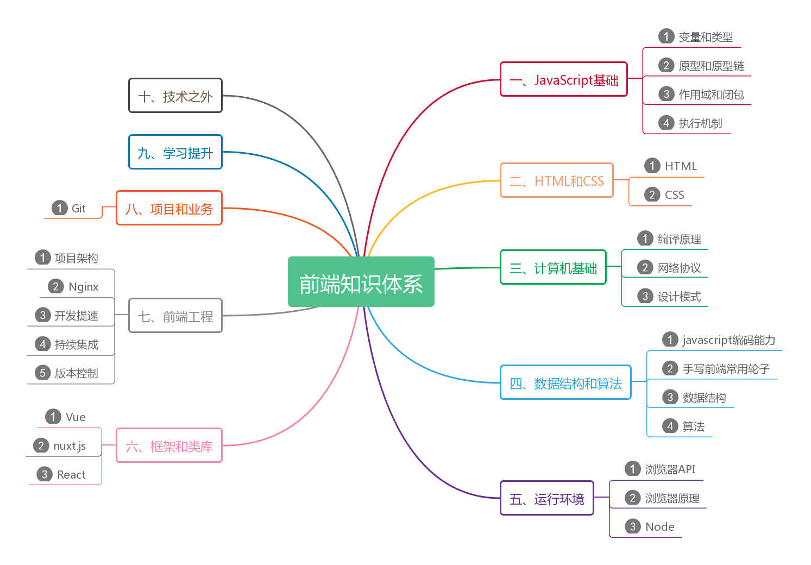

# javascript-knowledge-system
梳理自己的JavaScript的知识体系, 查缺补漏中...

### 前端知识体系思维导图

### 前端知识体系详细列表
- 一、JavaScript基础
	1. 变量和类型
	2. 原型和原型链
	3. 作用域和闭包
	4. 执行机制
- 二、HTML和CSS相关
- 三、计算机基础
	1. 编译原理
	2. 网络协议

### 参考资料
- 掘金文章 [一名合格前端工程师的自检清单](https://juejin.im/post/5cc1da82f265da036023b628)